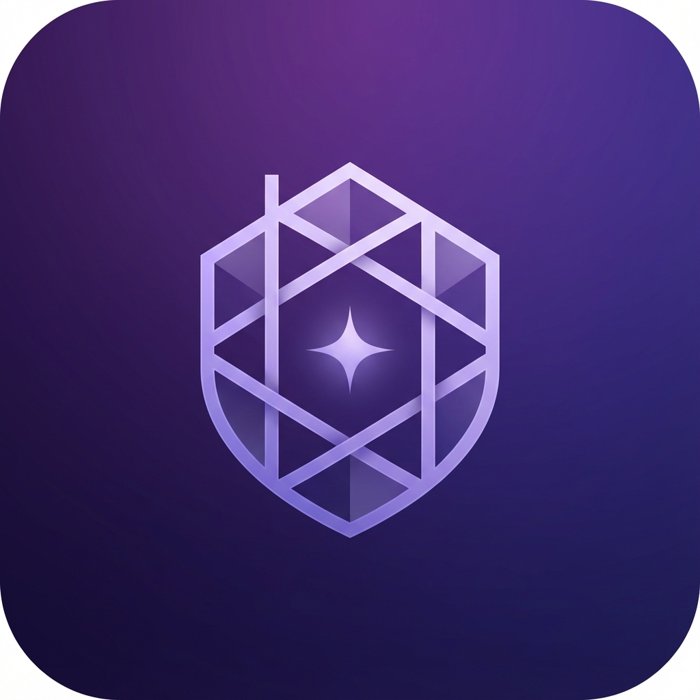

# Haven

> Your creative sanctuary for AI tools and productivity.



## 🚀 Quick Start

```bash
# Install dependencies
npm install

# Run in development mode
npm run electron:dev

# Build for production (creates installer in /release folder)
npm run electron:build
```

## 📁 Project Structure

```
Haven/
├── electron/           # Electron main process
│   ├── main.ts        # Main entry point
│   ├── preload.ts     # Preload scripts
│   └── services/      # Backend services
├── src/               # React frontend
│   ├── components/    # Reusable components
│   ├── pages/         # Page components
│   ├── context/       # React contexts
│   └── App.tsx        # Root component
├── build/             # App icons
└── release/           # Built installers (after build)
```

## ✨ Features

- **Dashboard** - Quick access to your creative tools
- **AI Tools** - Access ChatGPT, Claude, Midjourney, DALL-E, and more in one place
- **Browser** - Built-in web browser with download tracking
- **Music Hub** - Stream from Spotify, YouTube Music, SoundCloud + local music playback
- **Video Player** - Watch videos from YouTube and other platforms
- **Documents** - View PDFs and documents
- **Social Hub** - Manage all your social platforms
- **Asset Library** - Auto-captures all downloads from AI tools
- **Light/Dark Theme** - Customizable appearance

## 🔧 Build Commands

| Command | Description |
|---------|-------------|
| `npm run electron:dev` | Start development mode with hot reload |
| `npm run electron:build` | Build production installer |
| `npm run electron:compile` | Compile TypeScript only |
| `npm run dev` | Start Vite dev server (frontend only) |
| `npm run build` | Build everything for production |

## 🛠️ Tech Stack

- **Electron 28** - Desktop framework
- **React 18** - UI library
- **TypeScript** - Type safety
- **Tailwind CSS** - Styling
- **Vite** - Build tool
- **electron-store** - Local data persistence

## 🔒 Security Features

- Sandboxed webviews with session isolation
- Content Security Policy (CSP)
- Secure local file protocol
- No external data transmission - all data stays on your device

## 📝 License

MIT
